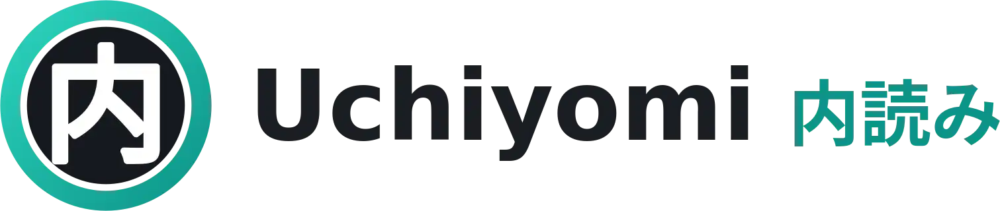

<p align="center">
  
</p>
<p align="center">
  <span>Opiniated and self-hosted manga & webtoon server with a modern, installable PWA. Highly inspired by <a href="https://github.com/Suwayomi/Suwayomi-Server">Suwayomi</a></span>
</p>

---


**Uchiyomi** is a golang API and Nuxt web UI bundle that lets you browse comics from sources, donwload it a read it directly into a modern PWA.

Although the base idea comes from Suwayomi, it comes from opinionated choices:
- **Download first:** As soon as you add a comic in your library, it will be downloaded. Only downloaded chapters can be read from the webapp.
- **No extensions**. Sources will be added one by one, and maintained as a whole
- **Multi-users management**
- **Data persistence** with database (for reading history for example)
- **OIDC**

## Development

### Pre-requisites

| Tool | Version |
|---|---|
| Go | 1.26.5 |
| Node | 26 |
| pnpm | ≥ 11 |
| [golangci-lint](https://golangci-lint.run/welcome/install/) | v2 |
| [lefthook](https://lefthook.dev/installation/) | — |

### Setup

```bash
pnpm --dir web install
lefthook install # git hooks installation
```

### Contributing
See [`CONTRIBUTING.md`](./CONTRIBUTING.md) for scripts and conventions.

## License

[AGPL-3.0-or-later](./LICENSE).
